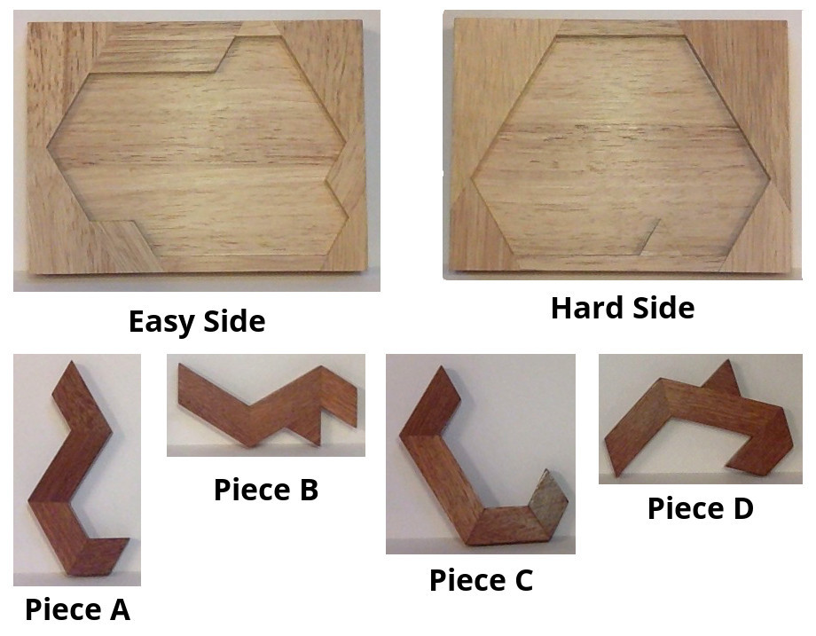
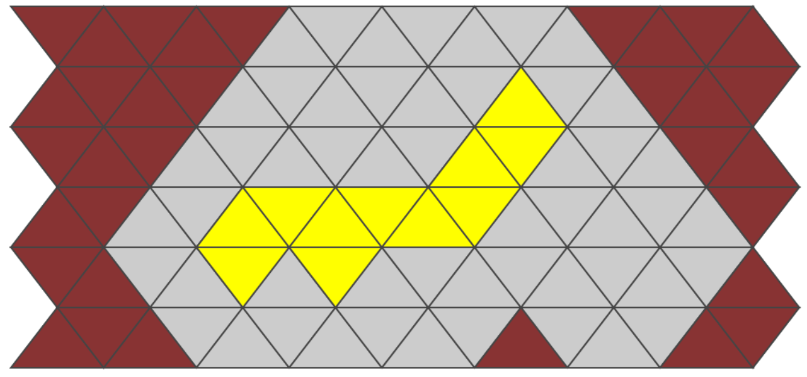

# wooden-puzzle
A repository to solve a wooden puzzle

All of this is based on [this article](http://engineering.khanacademy.org/posts/evil-puzzle.htm)

The puzzle pieces are denoted  and the board will be .
